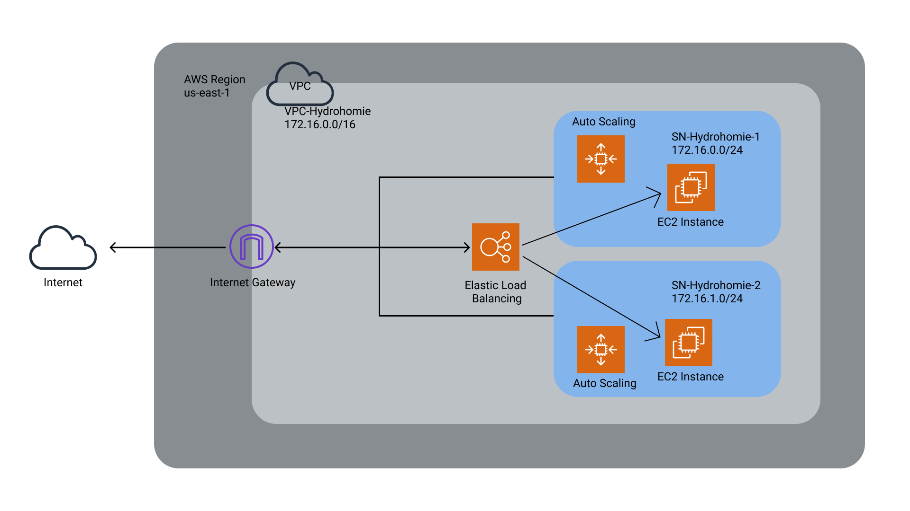

# HighAvailability ReadMe

## Topology
- making topologies is my passion

Contains the Terraform code to create a high availability infrastructure.
Creates the following:
- 1 VPC (172.16.0.0/16)
- 2 Subnets: 
    - 1 public (172.16.0.0/24) 
    - 1 private (172.16.1.0/24)
- 4 EC2 instances (2 webservers, 2 databases, 1)
