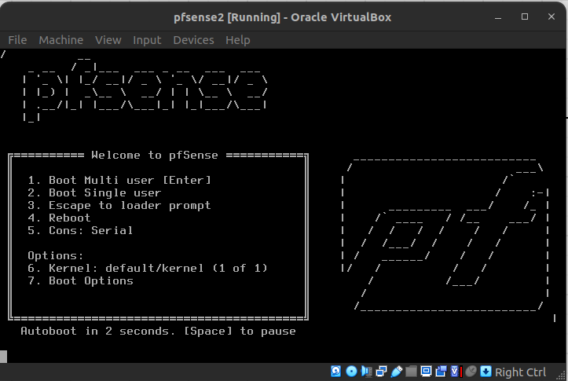
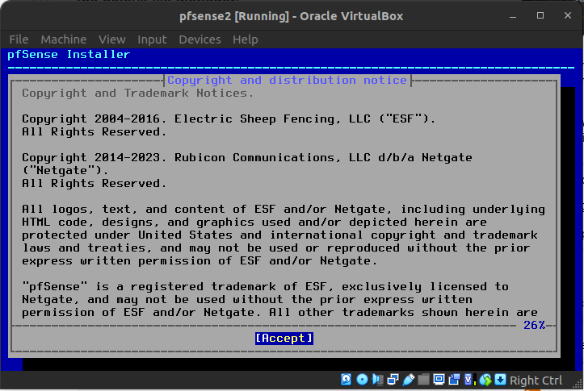
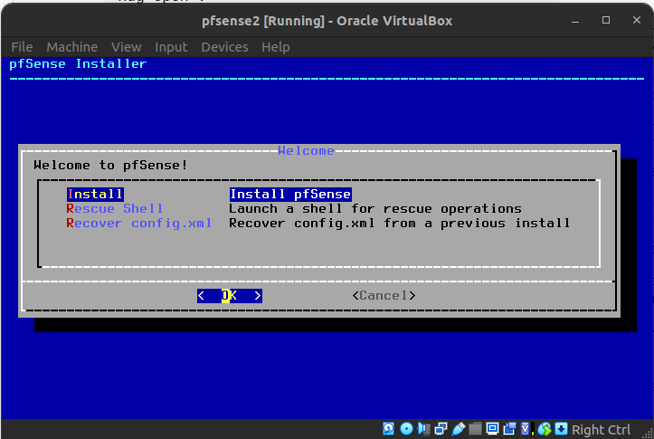

## 1. Initial setup
- Initial setup after downloading [pfsense.iso](https://www.pfsense.org/download/)

### First time install
- Just need to press the following keys:
    - `Enter`
    - `Spacebar`

- Here just let it autoboot

- `Enter` to `[Accept]`

- `Enter` to Install pfSense 

