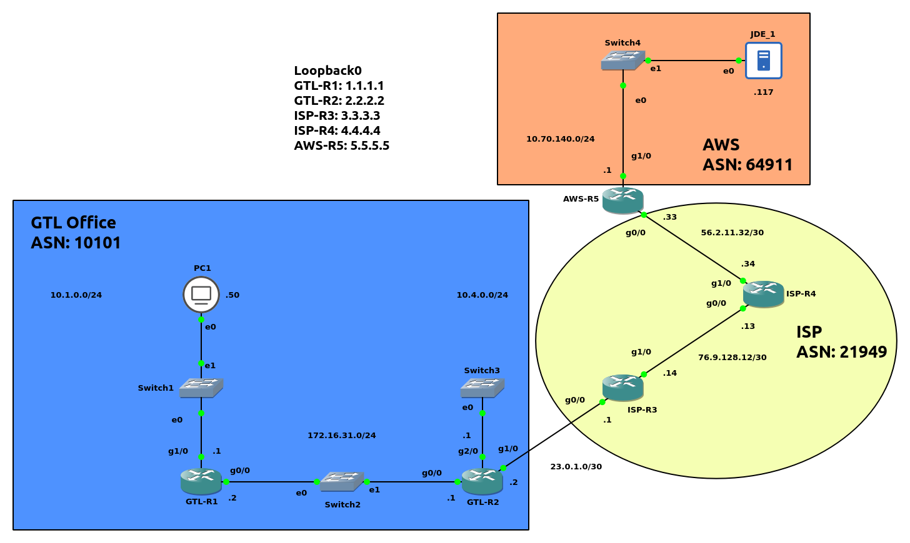

# IPSec VPN Tunnel with Cisco 7200

## Lab topology

- `GTL-R2` (`23.0.1.2`) connects to AWS via `AWS-R5` (`56.2.11.33`) 

## Router Configuration
- [GTL-R1](./Router_Config/GTL-R1.md)
- [GTL-R2](./Router_Config/GTL-R2.md)
- [ISP-R3](./Router_Config/ISP-R3.md)
- [ISP-R4](./Router_Config/ISP-R4.md)
- [AWS-R5](./Router_Config/AWS-R5.md)
